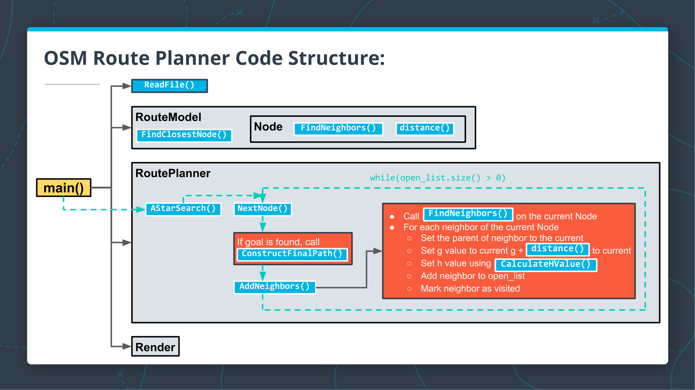

# Route Planning Project

This project implements a A* route planner running on OpenStreetMap in C++, similar to what is used on professional router planners like Google Maps.

It can calculate and draw the shortest path from point a to point b. The user enters two coordinates with x and y between 0 and 100, then the map is drawn using the io2d library and the shortest path is rendered in orange:


## C++ Files Location

The src directory contains the following files:
```
main.cpp
model.h and model.cpp
render.hand render.cpp
route_model.h and route_model.cpp
route_planner.h and route_planner.cpp
```

## Class Structure Diagram

This diagram shows the overall class structure for the project:




## Compiling and Running

### Compiling
To compile the project, first, create a `build` directory and change to that directory:
```
mkdir build && cd build
```
From within the `build` directory, then run `cmake` and `make` as follows:
```
cmake ..
make
```
### Running
The executable will be placed in the `build` directory. From within `build`, you can run the project as follows:
```
./OSM_A_star_search
```
Or to specify a map file:
```
./OSM_A_star_search -f ../<your_osm_file.osm>
```


## Cloning

When cloning this project, be sure to use the `--recurse-submodules` flag. Using HTTPS:
```
git clone https://github.com/udacity/CppND-Route-Planning-Project.git --recurse-submodules
```
or with SSH:
```
git clone git@github.com:udacity/CppND-Route-Planning-Project.git --recurse-submodules
```
